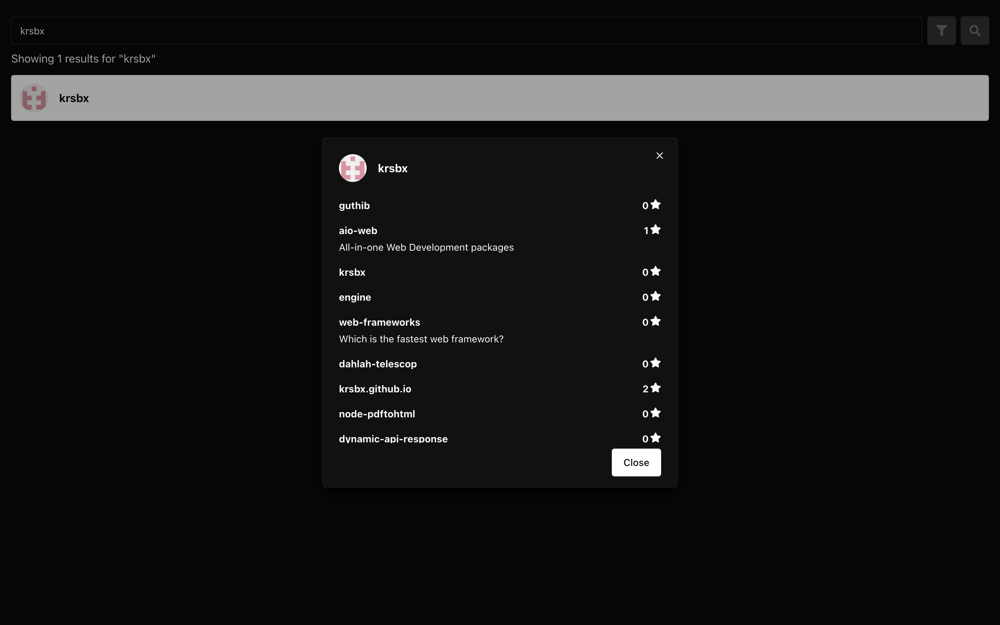
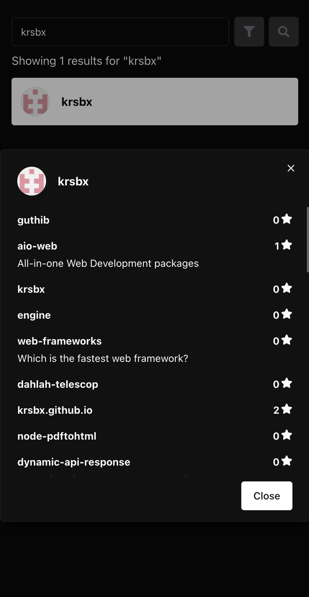

# Guthib

A simple and elegant GitHub user explorer built with React and TypeScript.

Enter a GitHub username to explore their public profile and repositories. The app demonstrates modern frontend best practices including good UX, responsive design, and robust testing.

🚀 **Live Demo**: [https://krsbx.github.io/guthib](https://krsbx.github.io/guthib)

---

## 📸 Screenshots

| Desktop | Mobile |
|--------|--------|
|  |  |

---

## 🔧 Getting Started

### 1. Clone the repository

```bash
git clone https://github.com/krsbx/guthib.git
cd guthib
```

### 2. Install dependencies

```bash
pnpm install
```

### 3. Set up environment variables

```bash
cp .env.example .env
```

- Replace `VITE_GITHUB_TOKEN` with your personal GitHub token (generate one [here](https://github.com/settings/tokens)).
- This token is used only in development mode to increase API rate limits.

> 🔒 **Note**: To use the token in production, update the logic in `src/utils/github/index.ts` to always use `import.meta.env.VITE_GITHUB_TOKEN`.

```ts
// Change this line:
const conditionalToken = import.meta.env.DEV;
// To this:
const conditionalToken = true;
```

### 4. Run the development server

```bash
pnpm run dev
```

Open [http://localhost:5173](http://localhost:5173) in your browser.

---

## 🧪 Testing

This project includes both unit and integration tests using **Vitest**.

- ✅ Unit tests: Cover utility functions and components.
- 🔄 Integration tests: Simulate user flows like searching and expanding a profile.

### Run tests

```bash
pnpm run test
```

### Run tests with coverage report

```bash
pnpm run test:coverage
```

---

## ⚙️ Features

- 🔍 Search GitHub users by username
- 🧾 View user profiles and public repositories
- ⌛ Loading states and graceful error handling
- 🎯 Fully responsive layout (mobile-first)
- ⌨️ Keyboard accessible components
- 🧪 Unit & integration tests with Vitest

---

## 🧠 Design Decisions

### Efficient API Usage
- Repository data is fetched **on demand** (when a user card is expanded) to reduce API usage and improve initial load time.

### UX & Accessibility
- Used **Chakra UI** for consistent design, responsive layout, and built-in accessibility.
- Implemented a **filter drawer** to help users quickly narrow down repositories.

---

## 🧰 Tech Stack

| Tool              | Purpose                        |
|-------------------|--------------------------------|
| React             | UI Library                     |
| TypeScript        | Static typing                  |
| Vite              | Lightning-fast build tool      |
| Chakra UI         | Styling & layout               |
| React Hook Form   | Form state management          |
| Zod               | Validation schema              |
| Vitest            | Unit & integration testing     |

---

## 📄 License

This project is open source and available under the [MIT License](LICENSE).

---

## 🙋‍♂️ Author

**[@krsbx](https://github.com/krsbx)**

---

## 🚧 Future Improvements

If more time were available, I would consider:
- Adding pagination for repositories
- Supporting infinite scrolling for better UX
- Improving accessibility scores using Lighthouse
- Adding CI/CD for automated testing and deploys via GitHub Actions
